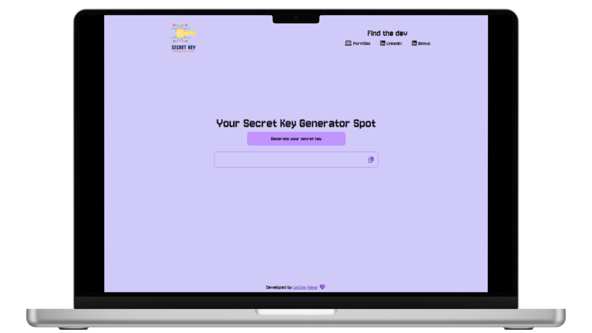
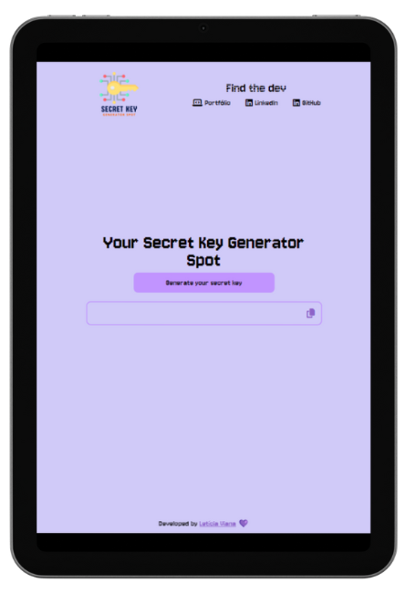
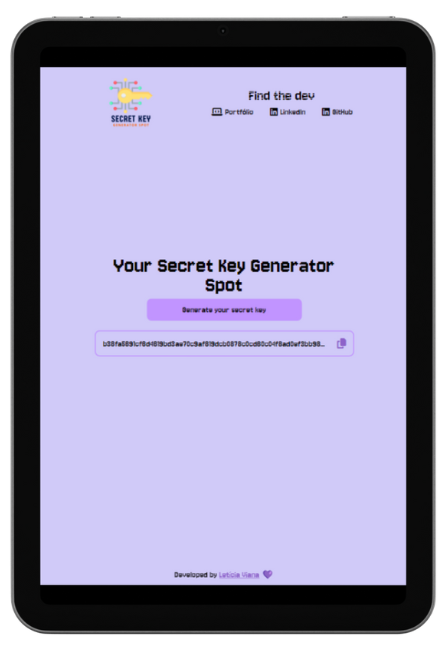
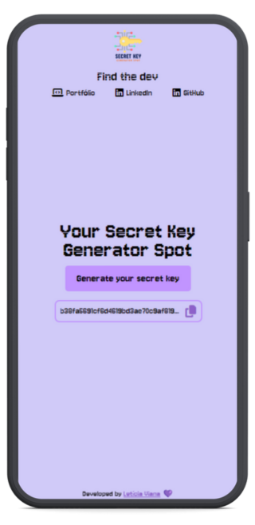

# 
**Your Secret Key Generator Spot**

    

## **Index:**

1. [About the project](#1-about-the-project)
2. [How to use](#2-how-to-use)
3. [Languages/technologies used](#3-languagestechnologies-used)
4. [Project images](#4-project-images)
5. [Status](#5-status)
6. [Author and contact](#6-author-and-contact)

#

### **1. About the project**

Welcome to Secret Key Generator Spot — a comprehensive online tool built using HTML, CSS, and JavaScript, designed to be a developer's go-to resource! This handy tool streamlines the process of generating secret keys for your application's environment variables with just a click. Developed from personal experiences during personal projects and my studies, this project serves not only as a skill-building exercise, but also as a valuable contribution to the developer community. Dive in and elevate your coding journey with enhanced security and convenience!

#

### **2. How to use**

- Click [here](https://lettyviana.github.io/secret-key-generator-spot/) to access the project and generate your secret key for your environment variables. 

#

### **3. Languages/technologies used**

 
    
    
        

 

#

### **4. Project images**

     
     
    

        
        
    

    
        

#

### **5. Status**

- [x] Completed.  

#

### **6. Author and contact**

#
